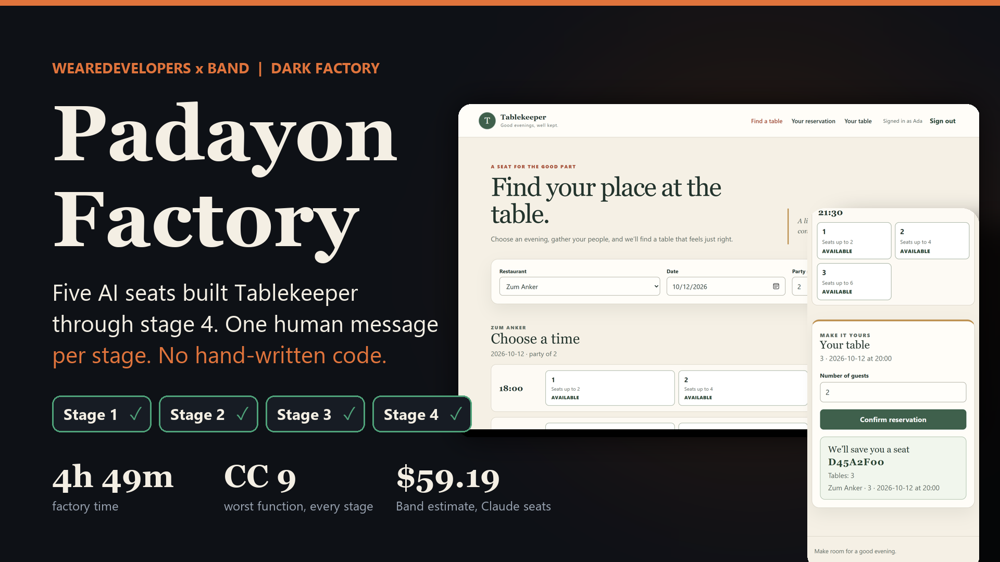
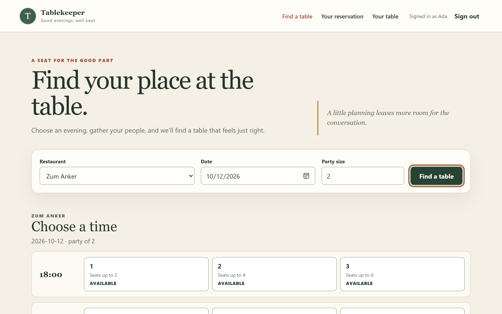
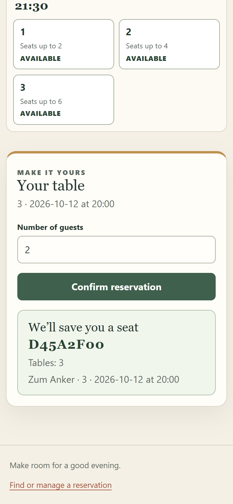

<p align="center"></p>

# Padayon Factory

A five-seat BAND factory that built the **Tablekeeper** reservation system through **stage 4**, in one room
(`PADAYON RUN V6`), with **one human message per stage** and no hand-written code.
Team **Padayon** | WeAreDevelopers x BAND *Dark Factory* | track **tablekeeper**

| | |
|---|---|
| Stage reached | **4 of 4**. All four folders claim their stage in the isolated harness from a clean container (120/120, 25/25, 7/7, 6/6) |
| Human input | 4 messages, one dispatch per stage. No hints, approvals, nudges or reruns |
| Seats | coordinator, core-builder, interface-builder (Codex) and tester, reviewer (Claude Code). Each has a generic mandate in `mandates/` |
| Quality held | worst function complexity **9 at every stage**, 0 functions above 10, largest file 132 lines, 0% duplication |
| Time | 4h 49m of factory time (38m, 1h25m, 1h11m, 1h34m) |
| Cost | $59.19 Band estimate for the two Claude seats (list price); three Codex seats on a flat plan, about 200M tokens |
| Independent audit | 506 spec-derived checks pass on stage 4, plus 3,600 random operations with invariants checked each step (`operator-audit/`) |
| Real rejections | stage 1 fixture passwords, stage 2 tester-check defects, stage 3 legacy-upgrade break, stage 4 maintainability regression |

## What the judges asked for, and where to find it

| Rubric | Where |
|---|---|
| **Factory** (generic, effective, reusable) | `mandates/` (no track vocabulary), `FACTORY.md` (seats, design choices, setup, what failed, measured time and spend, how bad work is caught) |
| **App** (coherent, responsive, clear states) | the stage folders; screenshots below; `handoffs/final-report-stage-4.md` for 375 px / 1280 px and axe results |
| **Agent Teamwork** (shared work, autonomy) | `room.json` (unedited, 6,570 events), `EVIDENCE.md` (message ids for every dispatch, rejection and acceptance), `handoffs/` |

Start with `FACTORY.md`, then `EVIDENCE.md`.

## The app the seats built

<p align="center">


</p>

## Run it

```sh
docker build -t tablekeeper:stage-4 ./stage-4
docker run --rm --cpus=2 --memory=2g -e PORT=8080 -p 8080:8080 tablekeeper:stage-4
# open http://localhost:8080/   (health: http://localhost:8080/health)
```

Every `stage-N/` has its own `Dockerfile` and `RUN.md`. The service needs no network at run time.

## Check it yourself

From the kickoff package:

```sh
python -m harness check <this repo> --track tablekeeper
python -m harness run --repo <this repo> --all --mode isolated --out <new dir>
```

## Repository map

```
FACTORY.md     the factory: seats, choices, costs, failures, limitations
EVIDENCE.md    claim -> room message id or commit
mandates/      one generic file per seat, each starts with Harness: and Model:
room.json      full-session export of the room, unedited
handoffs/      ledgers, handoffs, findings, per-stage records and final reports (written by the seats)
verification/  the tester's independent checks, written from the spec without reading the service
stage-1 .. stage-4/   one buildable service per stage (Dockerfile, RUN.md, source), written by the seats
operator-audit/ post-freeze test suite written from the specs (not used by the seats)
assets/        cover image and screenshots used in this README
```

## Who wrote what

Every file under `stage-*/` was written by a seat in the room (git authors `core-builder`, `interface-builder`).
`handoffs/` and `verification/` come from the coordinator, tester and reviewer. `README.md`, `FACTORY.md`,
`EVIDENCE.md`, `operator-audit/`, `assets/` and `.gitignore` were written by the team lead, outside any stage folder.
